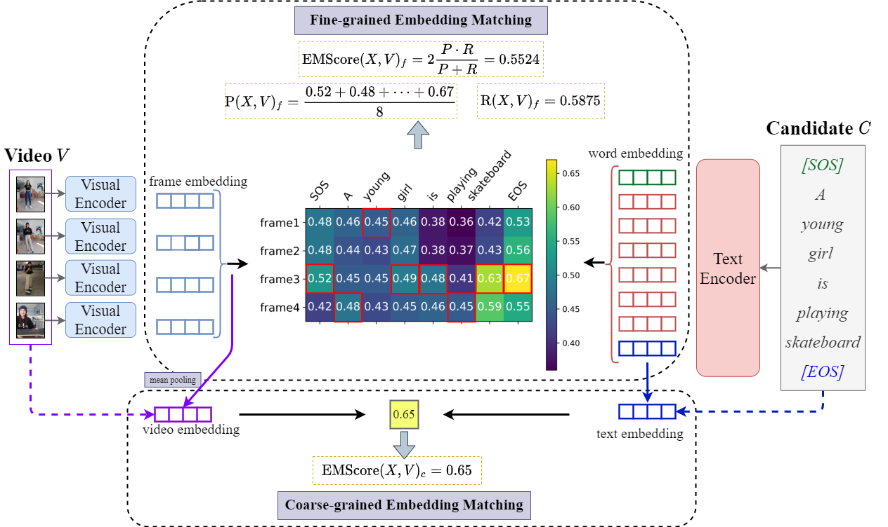

Automatic Video Captioning Evaluation Metric --- EMScore


## Overview

For an illustration, EMScore can be computed as:




## Installation

- modify the `encode_text()` function in `CLIP/clip/model.py` as follows:

  ```
  def encode_text(self, text, local=False):
      x = self.token_embedding(text).type(self.dtype)  # [batch_size, n_ctx, d_model]
  
      x = x + self.positional_embedding.type(self.dtype)
      x = x.permute(1, 0, 2)  # NLD -> LND
      x = self.transformer(x)
      x = x.permute(1, 0, 2)  # LND -> NLD
      x = self.ln_final(x).type(self.dtype)
  
      if local:
          x = x @ self.text_projection
      else:
          # x.shape = [batch_size, n_ctx, transformer.width]
          # take features from the eot embedding (eot_token is the highest number in each sequence)
          x = x[torch.arange(x.shape[0]), text.argmax(dim=-1)] @ self.text_projection
    
      return x
  ```

- Push your modified CLIP to your GitHub.

- Install

    ```
    $ conda install --yes -c pytorch pytorch=1.7.1 torchvision cudatoolkit=11.0
    $ pip install ftfy regex tqdm
    $ pip install git+https://github.com/$Yours_GitHub_name/CLIP
    ```

Replace `cudatoolkit=11.0` above with the appropriate CUDA version on your machine or `cpuonly` when installing on a machine without a GPU.


## Usage:

### A general demo
```
python demo.py 
```


### VATEX-EVAL
- download the files in the following link, and save at a storage directory  
```
https://drive.google.com/drive/folders/1jAfZZKEgkMEYFF2x1mhYo39nH-TNeGm6?usp=sharing
```

- run code
```
python VATEX-EVAL-demo.py --storage_path $storage_path --use_n_refs 1 --use_feat_cache --use_idf
```


### ActivityNet-FOIL
- download the files in the following link, and save at a storage directory  
```
https://drive.google.com/drive/folders/1oY9EJiEi_db_1GH-R33JDqfE8txffKR3?usp=sharing
```

- run code
```
python ActivityNet-FOIL_demo.py --storage_path $storage_path --use_references --use_idf
```

## Others
if you want extract embeddings by yourself:
```
python extract_video_embeddings.py --videos_path $your_video_path  --save_path $your_storage_path --backbone 'ViT-B/32' 
```


## Citation
If you find this code useful for your research, please consider citing:

```
@inproceedings{DBLP:conf/cvpr/ShiYXYLHZ22,
  author    = {Yaya Shi and
               Xu Yang and
               Haiyang Xu and
               Chunfeng Yuan and
               Bing Li and
               Weiming Hu and
               Zheng{-}Jun Zha},
  title     = {EMScore: Evaluating Video Captioning via Coarse-Grained and Fine-Grained
               Embedding Matching},
  booktitle = {{IEEE/CVF} Conference on Computer Vision and Pattern Recognition,
               {CVPR} 2022, New Orleans, LA, USA, June 18-24, 2022},
  year      = {2022},
}
```
